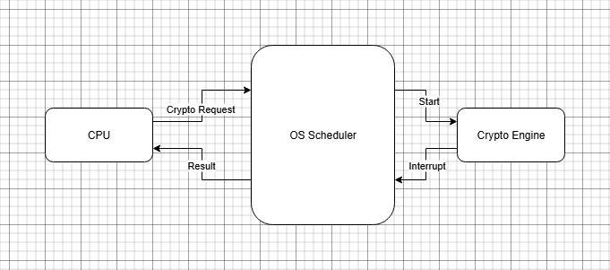

# Objective

Benchmark cryptographic performance on the **Raspberry Pi 5** to evaluate:
- **Execution time**, **throughput**, and **latency**  
- How the **crypto engine cooperates with the OS scheduler and CPU**

Algorithms tested:
- AES-128  
- AES-256  
- SHA-256  
- SHA-512  

---

## System Setup
- **Board:** Raspberry Pi 5 (Debian 12 Bookworm 64-bit)  
- **Libraries:** OpenSSL 3.5.1  
- **Tools:** Python 3 (venv + Matplotlib + Pandas), `perf`, `openssl speed`  
- **Crypto engine:** Linux Crypto API + OS scheduler cooperation (see diagram below)

---

## How the Crypto Engine Cooperates with the OS Scheduler and CPU

1. The CPU triggers crypto operations through the kernel driver (Linux Crypto API).  
2. The OS configures DMA buffers and starts the crypto engine.  
3. The engine executes independently, freeing the CPU for other tasks.  
4. The OS scheduler allocates CPU time to other threads while the engine runs.  
5. When the operation finishes, an **interrupt** notifies the kernel, which wakes the waiting process.

### Diagram


---

## How to Run the Benchmark Script

### 1. Run the full benchmark pipeline
```bash
# Clone or navigate into your project
cd ~/ECE4301_Fall2025/benchmarks_aes_only

# Make the script executable
chmod +x run_benchmarks.sh

# Execute
./run_benchmarks.sh


source venv/bin/activate
python parse_openssl.py
python plot_benchmarks.py


Observation

The crypto engine demonstrates strong parallelism between the CPU and the hardware accelerator.
When a cryptographic operation is initiated, the CPU dispatches the task through the Linux Crypto API and then continues executing other processes.
Meanwhile, the crypto engine executes the operation asynchronously, using DMA (Direct Memory Access) for data transfer and interrupt-driven communication to notify completion.

This non-blocking execution model allows the OS scheduler to efficiently allocate CPU time to other threads, improving overall system performance and throughput.
When the crypto engine completes a task, it triggers an interrupt, signaling the kernel to collect results and return control to the waiting process.

Among the tested algorithms, AES-128 and AES-256 achieved the best balance of throughput and latency, outperforming SHA-based operations in both efficiency and response time on the Raspberry Pi 5.
